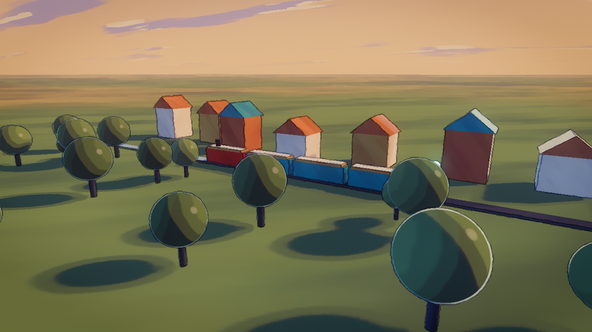
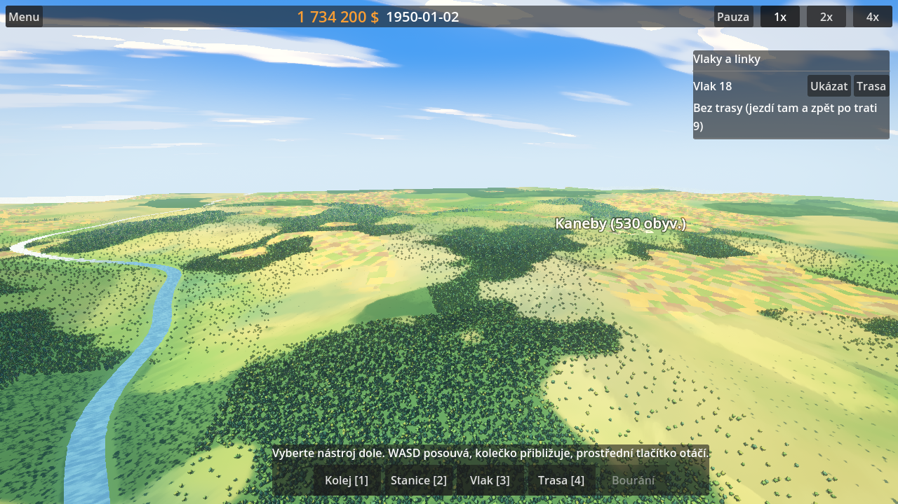

# OpenRail art style

**Česky:** OpenRail má vypadat jako malovaný obraz, inspirovaný vizuálem
animovaného seriálu Arcane: denní světlo, teplé osvětlené plochy a modré
stíny, velké čisté barevné plochy s jemným tahem štětce, ostré hrany se
světlým okrajem a výrazné siluety. Tento dokument popisuje pravidla stylu a
jak je používat v Godotu a Blenderu.
Z Arcane bereme jen způsob malby a svícení, ne architekturu, prostředí ani
motivy seriálu: domy, vozidla a krajina mají vlastní, realističtější design.



*`client/art/style_preview.tscn`, rendered with `client/tools/screenshot.gd`.*



*The game world (`main.tscn`): fields around towns, woods, depth fog.*

We take inspiration only from Arcane's *rendering technique* (painted
textures, graphic lighting, colour-rich shadows, coloured ink lines). Its
architecture, setting, technology and motifs are out of scope: OpenRail's
buildings, vehicles and landscapes follow their own, real-world-grounded
design, just painted this way. We don't copy its characters, locations,
logos or assets; everything in OpenRail is our own and CC BY-SA 4.0.

## Pillars

1. **Painted, but clean.** Large, clean areas of colour with only subtle
   brushwork. Hand-painted albedo, no photo textures, no normal-map micro
   detail, and almost no noise or grain on top.
2. **Daylight.** A bright image: warm lit surfaces, cool *blue* shadows
   (never purple, grey or black). Light falls in two clear steps with a
   warm edge between them.
3. **Crisp shapes.** Simplified forms, strong silhouettes, crisp edges with a
   light rim along them. Thin ink lines (a darkened version of the colour
   underneath, not black) mark silhouettes and hard creases.
4. **Rich but harmonious palette.** Cream walls, blue-grey slate roofs,
   copper green (verdigris) and terracotta, over muted meadow greens;
   saturated colour only for small accents.
5. **Readable first.** It is a tycoon game: trains, tracks and stations must
   stay readable from far away. Lines fade with distance, the ground stays
   calmer than the things on it.

## Palette

`ArtStyle.PALETTE` in `client/art/art_style.gd` is the source of truth.

| Name         | Use                                  | Colour    |
|--------------|--------------------------------------|-----------|
| `cream`      | plaster walls, lit highlights        | `#EDD9B3` |
| `slate`      | roofs (blue-grey slate)              | `#6B7D91` |
| `verdigris`  | copper-green roofs, domes, trims     | `#619E8A` |
| `terracotta` | tile roofs, brick                    | `#C7704D` |
| `brass`      | trims, lamps, some walls             | `#C79447` |
| `copper`     | locomotive details, pipes            | `#B85C38` |
| `teal`       | rolling stock, industrial accents    | `#29807A` |
| `signal_red` | signals, locomotives, warnings       | `#C72E24` |
| `meadow`     | grass, foliage                       | `#668A52` |
| `soot`       | track bed, chimneys, tree trunks     | `#38333D` |
| `ink`        | lines, dark metal, rails             | `#1F212B` |
| `glow_blue`  | emissive lamps, UI highlights        | `#4DBFF2` |

Saturated colours are for small accents (signals, trims, glow); large areas
(walls, ground, roofs seen from above) stay in the muted versions.

## How it works in the client

Everything lives in `client/art/`:

- `art_style.tscn` / `art_style.gd`: drop this scene into a level. It brings
  the WorldEnvironment (painted sky, cool ambient, Filmic tonemap, glow, fog),
  a warm key light (`Sun`) and a cool `RimLight`, and removes other
  environments and directional lights in the scene. Lighting is daylight:
  Filmic tonemap, a warm high sun and a cool blue ambient for shadows. It attaches the
  post-process to the active camera and repaints materials (below).
- `shaders/painterly.gdshader`: objects. Stepped toon ramp with a
  brush-broken terminator, warm terminator colour, world-space brush strokes
  (no UVs needed), rim light, a small painted highlight. With
  `use_uv_texture` it multiplies a hand-painted albedo texture.
- `shaders/painterly_ground.gdshader`: terrain. Soft, domain-warped washes
  of grass, dirt and then rock on steeper slopes, drier grass up high, a
  patchwork of fields with furrows and hedges, and a painted canopy under
  woods. Fine brush strokes only close to the camera; detail finer than a
  pixel fades out so the far ground stays calm. Slope comes from the normal
  and height from the world position, so it works on the flat plane and on
  real terrain meshes.
- `vegetation.gd`: woods and lone trees (MultiMesh per 1 km chunk, full trees
  up close, cheap blobs beyond `lod_distance`) and farmland around towns. It
  bakes a forest/farmland mask that ArtStyle passes to every material using
  the ground shader, so fields and forest floor sit under the trees. Trees
  under new track are cut down. It uses `assets/nature/tree_*.glb` when those
  models exist, otherwise built-in stand-ins, and `world/ground.gd`'s
  `height_at()` when there is terrain.
- `shaders/painted_sky.gdshader`: sky gradient, painted two-tone clouds,
  sun glow. The horizon colour matches the fog colour.
- `shaders/post_painterly.gdshader`: full screen. Kuwahara paint filter, ink
  lines from depth and normals, colour grade (saturation, contrast, cool
  shadows / warm highlights), canvas grain, vignette.
- `shaders/painterly_common.gdshaderinc`: shared noise, brush and ramp code.
- `style_preview.tscn`: a sandbox village for judging changes.

### Materials

Gameplay code that builds meshes can call `ArtStyle.paint(color)` for a
shared painterly material. It can also keep using a `StandardMaterial3D`:
ArtStyle converts those automatically (keeping colour and albedo texture),
including meshes added at runtime. Unshaded materials become ink, except
very bright ones (lamps, markers), which are left glowing.

Imported glTF models are converted per surface. A material whose name
starts with `M_` is replaced by `client/art/materials/<name>.tres` when that
file exists; otherwise it gets the automatic conversion. That's how a model
from `openrail-assets` gets a hand-tuned look without touching the model.

### Main knobs

| Where | Knob | Effect |
|-------|------|--------|
| painterly | `bands`, `band_softness` | number of light steps and how hard they are |
| painterly | `terminator_color`, `terminator_width` | colour of the light/shadow edge |
| painterly | `value_jitter`, `hue_jitter`, `brush_scale` | strength and size of brush variation |
| painterly | `rim_strength`, `rim_width` | rim light |
| post | `kuwahara_radius`, `kuwahara_mix` | how "painted" the whole frame looks (cost grows with radius²) |
| post | `line_width`, `line_strength`, `ink_keeps_color` | ink lines |
| post | `line_fade_distance` | camera distance where lines disappear |
| post | `shadow_tint`, `highlight_tint`, `split_tone_strength` | colour grade |
| Environment | `ambient_light_color` | colour of all shadows |
| Environment | `fog_depth_begin`, `fog_depth_end`, `fog_depth_curve` | where the land fades into the horizon (depth fog; cameras get `far` of at least `min_camera_far`) |
| ground | `field_size`, `dirt_slope`, `rock_slope`, `highland_start` | fields, slopes and heights |
| vegetation | `trees_per_forest_pixel`, `lod_distance`, `visibility_end` | tree density and draw distance |
| Sun | `light_color`, rotation | time of day |

## Rules for assets (Blender)

- **Textures:** hand-painted albedo only, one texture per material, no
  normal, roughness or metal maps (the shader ignores them). Paint light
  variation and wear into the albedo but no baked shadows; the engine lights
  it. Visible brush strokes are good.
- **Texel density:** about 256 px per metre for vehicles and props seen up
  close, 64 to 128 px per metre for buildings and terrain tiles. Power-of-two
  sizes.
- **Shapes:** chunky, slightly exaggerated silhouettes and bevels; the ink
  lines come from silhouettes and sharp creases, so keep hard edges where you
  want a line and smooth normals where you don't.
- **Materials:** name them `M_<Thing>_<Part>` (for example `M_Loco_Body`).
  Keep them simple Principled BSDF with just the albedo texture; the client
  replaces them by name.
- **Orientation and scale:** metres, vehicles face −Z, origin at the top of
  the rail.
- **Foliage:** alpha-tested cards (alpha clip in Blender) are fine; they keep
  their alpha threshold after conversion.
- **Trees** (`assets/nature/tree_*.glb`) are planted by the hundred thousand,
  so keep them under 1500 triangles (ideally 300 to 800); heavier ones are
  skipped for the built-in stand-in with a warning. Origin at the foot of the
  trunk; the client scales them to about 12 m.

## Previewing without the editor

```sh
cargo build -p openrail-gdext   # only needed for main.tscn
godot --path client --script res://tools/screenshot.gd -- \
    --scene res://art/style_preview.tscn --out /tmp/preview.png \
    --look-from 60,45,130 --look-at -20,5,0
```

On a machine without a GPU this works under `xvfb-run` with Mesa's software
Vulkan (`VK_ICD_FILENAMES=/usr/share/vulkan/icd.d/lvp_icd.json`); that's how
the screenshot above was made.

## Performance notes

The post-process costs one Kuwahara pass (`(2r+1)²` samples, 25 at the
default radius 2) plus 10 depth/normal taps per pixel, which is fine on
desktop GPUs at 1080p. On low-end hardware set `kuwahara_radius` to 0 or
set `post_process = false` on ArtStyle.

The full post-process needs the Forward+ renderer (normal-roughness buffer).
On the Mobile and Compatibility (OpenGL) renderers, used on older GPUs,
ArtStyle switches to `post_painterly_lite.gdshader`: the same colour grade and
vignette, without the paint filter and ink lines. The object, ground and sky
shaders work on all three renderers.
